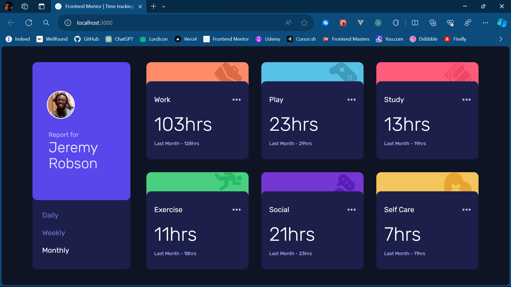

# Frontend Mentor - Time tracking dashboard solution

This is a solution to the [Time tracking dashboard challenge on Frontend Mentor](https://www.frontendmentor.io/challenges/time-tracking-dashboard-UIQ7167Jw). Frontend Mentor challenges help you improve your coding skills by building realistic projects. 

## Table of contents

- [Overview](#overview)
  - [The challenge](#the-challenge)
  - [Screenshot](#screenshot)
  - [Links](#links)
- [My process](#my-process)
  - [Built with](#built-with)
  - [What I learned](#what-i-learned)
  - [Continued development](#continued-development)
- [Author](#author)

## Overview

### The challenge

Users should be able to:

- View the optimal layout for the site depending on their device's screen size
- See hover states for all interactive elements on the page
- Switch between viewing Daily, Weekly, and Monthly stats

### Screenshot

### Links

- Solution URL: [Visit the solution](https://github.com/Aniket200-ind/time-tracking-dashboard-main)
- Live Site URL: [Visit site](https://schedule-dashboard.vercel.app/)

## My process

### Built with
- [Next.js](https://nextjs.org/) - React framework
- [React](https://reactjs.org/) - JS library
- [Tailwind CSS](https://tailwindcss.com/) - CSS framework
- [TypeScript](https://www.typescriptlang.org/) - TypeScript language
- Semantic HTML5 markup
- Flexbox
- CSS Grid
- Mobile-first workflow

### What I learned

I learned to use Nextjs and React with Tailwind CSS for styling. I was able to create a responsive website with the help of Tailwind CSS. I also learned to use the grid system. I also learned more about certain React core concepts like State management and passing down the Props. I also learned to use TypeScript for type checking. I tried my best to use type-checking wherever needed. Also I tried to use AI whenever I was stuck and had errors.

### Continued development

I want to continue learning React and Next framework. I want to learn more about the core concepts of React and Next. I also want to learn TypeScript and use it in my future projects.

## Author

- Frontend Mentor - [@Aniket200-ind](https://www.frontendmentor.io/profile/Aniket200-ind)
- Twitter - [@AniketBotre2604](https://twitter.com/AniketBotre2604)